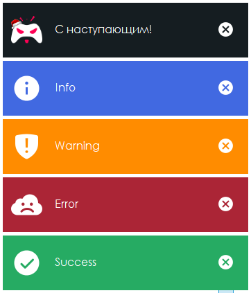

## NotificationManager
[](https://www.nuget.org/packages/NotificationManager/)
[](https://www.nuget.org/packages/NotificationManager/)
[](https://github.com/Irval1337/NotificationManager/commits/main)

### Установка библиотеки
**Package Manager**
``` powershell
PM> Install-Package NotificationManager
```
**.NET CLI**
``` bash
> dotnet add package NotificationManager
```

### Основные возможности
- Отображение уведомлений с заданным текстом и типом
- Использование кастомизируемых уведомлений
- Изменение положения отображения и скорости анимаций
- Возможность настройки цвета и изображений на отображаемой форме

Документация ко всем методам и свойствам библиотеки находится на странице Wiki.

Примеры использования библиотеки: https://github.com/Irval1337/NotificationManager/tree/main/Examples
Код уведомления основан на статье с сайта https://csharpui.com/

### Превью работы

